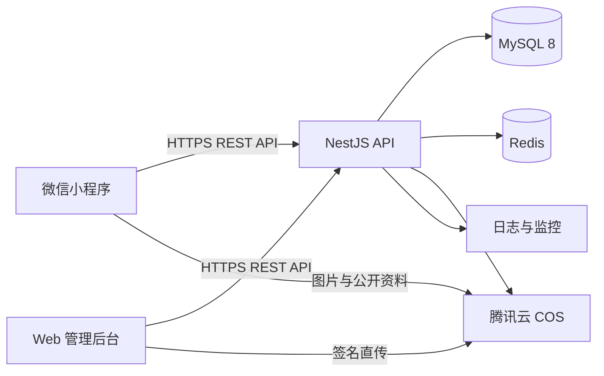

# 中康参芝微信小程序技术架构设计

> 文档状态：方案草案
>
> 适用范围：企业展示、品牌背书、明星产品、招商代理、投资合作、表单与线索管理
>
> 架构原则：保留现有小程序小样，逐步替换本地静态数据，不重新搭建前台

## 1. 建设目标

本项目建设为一套前后台分离的正式业务系统：

- 前台：微信原生小程序，负责内容展示、产品展示和合作申请。
- 后台：Web 管理后台，负责内容、产品、招商、投资合作、媒体资料和线索管理。
- 服务端：统一 REST API，负责权限、业务规则、数据读写、文件管理和审计。
- 数据层：MySQL 保存结构化数据，Redis 保存缓存和限流状态，腾讯云 COS 保存图片与资料。

本期不重做现有首页、产品、实力、合作四个主页面。已有页面逐步从本地数据切换到 API，视觉和交互继续沿用当前小样。

## 2. 核心架构决策

### 2.1 内容可维护，不做任意页面搭建器

前台的布局组件、视觉样式和交互由代码控制；标题、正文、卡片、指标、图片、排序、上下架状态等业务内容由后台维护。

这样可以同时满足：

- 页面内容不写死；
- 后台人员可以日常更新；
- 页面结构不会因错误配置而崩溃；
- 小程序端可以稳定控制性能、合规和视觉品质；
- 后续需要新布局时，由开发新增一个 `sectionType`，后台再开放对应配置表单。

### 2.2 保留现有小程序根目录

微信开发者工具继续直接打开当前项目根目录，不移动 `app.js`、`app.json`、`pages`、`components` 等现有文件。后台与服务端作为同一 Git 仓库中的独立应用新增，避免影响当前预览链路。

新增目录必须加入 `project.config.json` 的上传忽略列表，防止管理后台、服务端和依赖进入小程序代码包。

### 2.3 所有业务媒体转移到对象存储

产品图、Banner、企业图册、资质证书、检测报告、媒体报道附件等统一上传到腾讯云 COS。小程序代码包只保留 Tab 图标、加载占位图等必要静态资源，从根本上规避主包 2MB 限制。

### 2.4 先单体服务，按业务模块组织

V1 使用一个 NestJS API 服务和一个 MySQL 数据库，内部按内容、产品、招商、媒体、表单、线索、权限划分模块。当前团队和业务量不需要微服务；模块边界保留未来拆分能力。

## 3. 总体架构



### 3.1 请求链路

1. 管理员在 Web 后台编辑内容并发布。
2. API 将结构化数据写入 MySQL，并清除相应 Redis 缓存。
3. 小程序请求 `/api/v1/public/*` 获取已发布内容。
4. 图片和公开资料由 COS/CDN 返回，API 只返回媒体元数据和访问地址。
5. 用户提交代理、投资或咨询表单后，API 创建线索并记录来源。
6. 业务人员在后台分配、跟进、修改状态并按权限导出线索。

## 4. 技术栈

| 层级 | 选型 | 说明 |
| --- | --- | --- |
| 微信小程序 | 原生 JavaScript + WXML + WXSS | 保留现有工程，改造成本最低 |
| 小程序组件 | TDesign Miniprogram 1.9.5 | 延续现有依赖与组件规范 |
| 小程序请求层 | 封装 `wx.request` / `wx.uploadFile` | 统一鉴权、错误、重试和请求 ID |
| Web 后台 | Vue 3 + TypeScript + Vite | 适合中后台，开发和维护成本可控 |
| 后台 UI | TDesign Vue Next | 与小程序保持同一设计体系 |
| 后台状态与路由 | Pinia + Vue Router | 权限路由、筛选条件和用户状态管理 |
| 服务端 | Node.js LTS + NestJS + TypeScript | 模块化、校验、鉴权和 OpenAPI 支持完整 |
| ORM | Prisma | 数据模型、迁移、类型和事务管理 |
| 数据库 | MySQL 8.0 | 业务数据主存储 |
| 缓存 | Redis 7 | 公共内容缓存、验证码/限流、短期会话状态 |
| 文件存储 | 腾讯云 COS + CDN | 图片、证书、报告和导出文件存储 |
| API 文档 | OpenAPI 3 / Swagger | 前后台联调和接口验收 |
| 容器与代理 | Docker Compose + Nginx | 测试和生产环境统一部署 |
| 日志 | Pino JSON 日志 + 云日志服务 | 请求追踪、异常定位和审计 |
| 测试 | Jest + Supertest + Playwright | 单元、接口和后台关键流程测试 |

## 5. 项目目录结构

```text
zhishentang-shop/
├─ app.js                         # 现有小程序入口，保留
├─ app.json
├─ app.wxss
├─ pages/                         # 小程序页面
│  ├─ home/
│  ├─ category/
│  ├─ cart/                       # 当前“实力”主屏
│  ├─ usercenter/                 # 当前“合作”主屏
│  └─ official/                   # 正式内容、产品详情、申请表单
├─ components/                    # 小程序公共组件
├─ services/                      # 小程序 API 请求层
│  ├─ client.js
│  ├─ content.js
│  ├─ products.js
│  ├─ forms.js
│  └─ leads.js
├─ repositories/                  # 小程序数据适配层
├─ config/                        # 小程序环境与域名配置
├─ admin-web/                     # Web 管理后台
│  ├─ src/
│  │  ├─ api/
│  │  ├─ assets/
│  │  ├─ components/
│  │  ├─ layouts/
│  │  ├─ router/
│  │  ├─ stores/
│  │  ├─ utils/
│  │  └─ views/
│  │     ├─ dashboard/
│  │     ├─ content/
│  │     ├─ products/
│  │     ├─ agency/
│  │     ├─ investment/
│  │     ├─ media/
│  │     ├─ leads/
│  │     └─ system/
│  ├─ public/
│  ├─ package.json
│  └─ vite.config.ts
├─ api-server/                    # 后端 API
│  ├─ src/
│  │  ├─ common/                  # 异常、鉴权、校验、日志、分页
│  │  ├─ config/
│  │  ├─ modules/
│  │  │  ├─ auth/
│  │  │  ├─ admin-users/
│  │  │  ├─ content/
│  │  │  ├─ products/
│  │  │  ├─ media/
│  │  │  ├─ forms/
│  │  │  ├─ leads/
│  │  │  ├─ exports/
│  │  │  └─ audit/
│  │  └─ main.ts
│  ├─ prisma/
│  │  ├─ schema.prisma
│  │  ├─ migrations/
│  │  └─ seed.ts
│  ├─ test/
│  └─ package.json
├─ packages/
│  └─ contracts/                  # OpenAPI 产物、枚举和共享接口类型
├─ infra/
│  ├─ docker/
│  ├─ nginx/
│  ├─ scripts/
│  └─ env/                        # 只放示例文件，不提交密钥
├─ docs/
│  ├─ architecture/
│  ├─ api/
│  ├─ deployment/
│  └─ materials/
├─ .github/workflows/
├─ project.config.json
└─ README.md
```

说明：根目录沿用现有小程序 `package.json`。`admin-web` 和 `api-server` 使用各自依赖；后续可增加 `pnpm-workspace.yaml` 统一管理，但不要求微信开发者工具参与后台构建。

## 6. 后台模块结构

### 6.1 内容管理

- 首页 Banner：图片、标题、说明、按钮、跳转类型、排序、展示时间、状态。
- 企业内容：公司简介、品牌故事、发展历程、企业数据、联系方式。
- 品牌背书：资质证书、检测报告、企业荣誉、合作案例、媒体报道。
- 通用内容块：标题、摘要、正文、图片、卡片、指标、时间线、FAQ。
- 发布控制：草稿、发布、下线；记录发布人和发布时间。

### 6.2 产品管理

- 产品分类、产品排序和上下架。
- 产品基础信息：名称、副标题、封面、招商定位、状态。
- 产品详情：卖点、原料、工艺、规格、使用场景、招商价值。
- 产品媒体：主图、详情图、视频和资料附件。
- 产品扩展字段使用结构化详情表，不把完整详情写成不可检索的大段 HTML。

### 6.3 招商与投资合作管理

- 招商对象、合作模式、代理权益、扶持政策、合作流程、常见问题。
- 投资项目、商业模式、增长规划、合作方向、资源需求。
- 页面内容复用内容块模型，但后台提供独立菜单和专用编辑表单。
- V1 不支持任意拖拽页面，仅支持已定义模块的显示、隐藏和排序。

### 6.4 线索管理

- 代理申请、投资合作、普通咨询三类线索统一入库。
- 支持类型、状态、等级、负责人、来源、时间、关键词筛选。
- 支持线索分配、状态流转、跟进记录、下次跟进时间和备注。
- 支持脱敏查看、按权限导出、导出记录和操作审计。
- 默认不提供物理删除，使用软删除和“无效线索”状态。

### 6.5 媒体资料管理

- 图片：JPG、PNG、WebP；记录宽高、大小、哈希和替代文本。
- 资料：PDF、DOCX、XLSX；记录文件名、类型、大小和访问级别。
- 公开文件可由小程序访问；内部资料使用私有桶签名地址。
- 删除前检查引用关系，已被内容引用的文件不允许直接删除。

## 7. 数据库方案

### 7.1 通用约定

- 数据库：MySQL 8.0，字符集 `utf8mb4`，时区 `Asia/Shanghai`。
- 主键：`BIGINT UNSIGNED` 或分布式 ID，对外统一返回字符串，避免 JavaScript 精度问题。
- 公共字段：`created_at`、`updated_at`；需要回收站的表增加 `deleted_at`。
- 发布表增加 `status`、`published_at`、`published_by`、`version`。
- 手机号等敏感字段应用层加密，列表默认脱敏显示。
- `JSON` 只保存灵活配置或动态表单原始值；需要筛选、关联、排序的字段使用独立列。

### 7.2 核心数据表

| 表名 | 关键字段 | 用途 |
| --- | --- | --- |
| `site_settings` | `key`, `value_json`, `is_public` | 公司信息、联系方式、全局设置 |
| `banners` | `placement`, `title`, `asset_id`, `link_type`, `link_value`, `sort_order`, `status` | 首页及栏目 Banner |
| `content_pages` | `slug`, `page_type`, `title`, `subtitle`, `status`, `version` | 企业、品牌、招商、投资等页面 |
| `content_sections` | `page_id`, `section_key`, `section_type`, `title`, `body`, `config_json`, `sort_order`, `is_visible` | 页面模块与结构化内容 |
| `content_cards` | `section_id`, `title`, `description`, `asset_id`, `link_json`, `sort_order` | 内容模块中的卡片、指标、步骤 |
| `timeline_items` | `page_id`, `year_label`, `title`, `description`, `sort_order` | 企业发展历程 |
| `articles` | `category`, `title`, `summary`, `cover_asset_id`, `body`, `source`, `published_at`, `status` | 媒体报道、新闻和合作案例详情 |
| `article_assets` | `article_id`, `asset_id`, `usage`, `sort_order` | 文章图片与附件 |
| `product_categories` | `name`, `slug`, `sort_order`, `status` | 明星产品分类 |
| `products` | `category_id`, `name`, `slug`, `subtitle`, `cover_asset_id`, `summary`, `status`, `sort_order` | 产品基础信息 |
| `product_sections` | `product_id`, `section_type`, `title`, `content_json`, `sort_order` | 卖点、原料、工艺、场景、招商价值 |
| `product_specs` | `product_id`, `name`, `value`, `sort_order` | 规格参数 |
| `product_assets` | `product_id`, `asset_id`, `usage`, `sort_order` | 产品主图、详情图、视频和资料 |
| `media_assets` | `object_key`, `bucket`, `mime_type`, `size_bytes`, `width`, `height`, `sha256`, `access_level`, `status` | 图片和资料元数据 |
| `lead_forms` | `code`, `name`, `lead_type`, `status`, `success_message`, `version` | 代理、投资、咨询表单定义 |
| `lead_form_fields` | `form_id`, `field_key`, `label`, `field_type`, `options_json`, `required`, `sort_order` | 后台可维护的表单字段 |
| `leads` | `lead_no`, `form_id`, `lead_type`, `name_enc`, `mobile_enc`, `region`, `status`, `level`, `assignee_id`, `source`, `payload_json`, `last_followed_at` | 线索主表 |
| `lead_followups` | `lead_id`, `admin_user_id`, `follow_type`, `content`, `next_follow_at`, `created_at` | 跟进记录，只追加不覆盖 |
| `lead_attachments` | `lead_id`, `asset_id`, `field_key` | 申请表附件 |
| `lead_tags` | `name`, `color`, `status` | 线索标签 |
| `lead_tag_relations` | `lead_id`, `tag_id` | 线索与标签多对多关系 |
| `admin_users` | `username`, `password_hash`, `display_name`, `mobile`, `status`, `last_login_at` | 后台账号 |
| `roles` | `code`, `name`, `description` | 角色 |
| `permissions` | `code`, `name`, `resource`, `action` | 权限点 |
| `admin_user_roles` | `admin_user_id`, `role_id` | 用户角色关系 |
| `role_permissions` | `role_id`, `permission_id` | 角色权限关系 |
| `refresh_tokens` | `admin_user_id`, `token_hash`, `expires_at`, `revoked_at` | 后台刷新令牌 |
| `export_jobs` | `type`, `filters_json`, `status`, `asset_id`, `requested_by`, `expires_at` | 线索异步导出 |
| `audit_logs` | `admin_user_id`, `action`, `resource`, `resource_id`, `before_json`, `after_json`, `ip`, `request_id` | 后台操作审计 |

### 7.3 主要索引

- `products(status, category_id, sort_order)`
- `content_pages(slug, status)` 唯一索引
- `content_sections(page_id, sort_order)`
- `leads(lead_type, status, created_at)`
- `leads(assignee_id, status, next_follow_at)`；`next_follow_at` 可放主表或由跟进表汇总更新
- `lead_followups(lead_id, created_at)`
- `media_assets(sha256)` 用于查重
- `audit_logs(resource, resource_id, created_at)`

### 7.4 数据发布与缓存

- 草稿数据仅后台可见，公开接口只查询 `published` 数据。
- 发布操作使用事务更新状态和版本号。
- 公共内容缓存键包含页面/产品版本，默认缓存 5 分钟。
- 发布或下线后主动清除对应 Redis 缓存。
- 小程序本地可缓存最近一次成功响应并记录版本；网络失败时展示缓存和更新时间，不能将本地静态文案作为正式数据源。

## 8. 接口方案

### 8.1 统一约定

- 基础路径：`/api/v1`。
- 传输协议：HTTPS + JSON，上传接口除外。
- 时间格式：ISO 8601，统一带时区。
- 成功响应：`{ code: 0, message: "ok", data, requestId }`。
- 失败响应：使用 HTTP 状态码并返回稳定业务错误码。
- 列表分页：`page`、`pageSize`，响应包含 `items`、`total`、`page`、`pageSize`。
- 写操作支持 `Idempotency-Key`；表单提交必须幂等，防止重复点击生成多条线索。
- 更新操作携带 `version`，使用乐观锁避免多人编辑互相覆盖。
- OpenAPI 文档由服务端自动生成，前后台以接口文档为验收依据。

### 8.2 小程序公开接口

| 方法 | 路径 | 用途 |
| --- | --- | --- |
| `GET` | `/public/bootstrap` | 全局配置、联系方式和内容版本 |
| `GET` | `/public/banners?placement=home` | 获取已发布 Banner |
| `GET` | `/public/pages/:slug` | 企业、品牌、招商、投资页面内容 |
| `GET` | `/public/product-categories` | 产品分类 |
| `GET` | `/public/products` | 产品列表与筛选 |
| `GET` | `/public/products/:slug` | 产品详情 |
| `GET` | `/public/articles` | 媒体报道、合作案例列表 |
| `GET` | `/public/articles/:id` | 文章详情 |
| `GET` | `/public/forms/:code` | 获取动态表单结构 |
| `POST` | `/public/leads` | 提交代理、投资或咨询申请 |
| `POST` | `/public/uploads` | 用户附件上传，按表单配置开放 |

小程序调用接口不需要后台账号。服务端通过微信登录态、请求频率、IP、设备信息和幂等键防止滥用；如暂不要求用户登录，`openid` 允许为空。

### 8.3 管理后台接口

| 模块 | 主要接口 |
| --- | --- |
| 认证 | `POST /admin/auth/login`、`refresh`、`logout`、`GET /admin/auth/me` |
| 内容 | `/admin/content/pages`、`/sections`、`/publish`、`/offline` |
| Banner | `/admin/banners`、排序、发布、下线 |
| 产品 | `/admin/product-categories`、`/admin/products`、详情模块、上下架 |
| 文章 | `/admin/articles`、发布、下线 |
| 媒体 | `/admin/media/upload-init`、`upload-complete`、列表、引用检查、删除 |
| 表单 | `/admin/forms`、字段排序、启用、停用、预览 |
| 线索 | `/admin/leads`、详情、分配、状态、标签、跟进记录 |
| 导出 | `POST /admin/lead-exports`、`GET /admin/lead-exports/:id` |
| 用户权限 | `/admin/users`、`/admin/roles`、`/admin/permissions` |
| 审计 | `GET /admin/audit-logs` |

### 8.4 文件上传流程

Web 管理后台：

1. 后台调用 `upload-init`，API 校验文件类型、大小和业务权限。
2. API 生成限定对象键、类型和有效期的 COS 临时上传凭证。
3. 浏览器直传 COS，避免大文件经过 API 服务器。
4. 后台调用 `upload-complete`，API 校验对象并创建 `media_assets` 记录。

小程序表单附件：

1. 小程序调用 `wx.uploadFile` 上传到 API。
2. API 校验 MIME、扩展名、文件头和大小后流式写入 COS。
3. API 返回 `assetId`，提交表单时关联线索。

默认限制建议：图片单张 10MB，资料单个 30MB；具体限制由后台系统配置。可执行文件、脚本和压缩包默认禁止上传。

## 9. 权限方案

### 9.1 身份类型

- 小程序访客：只访问公开内容和提交表单，无后台权限。
- 超级管理员：系统配置、账号角色和所有业务数据。
- 内容编辑：企业、品牌、Banner、文章、媒体资料。
- 产品运营：产品分类、产品信息、产品上下架和产品媒体。
- 招商负责人：招商与投资内容、全部招商线索、分配与导出。
- 线索跟进人员：仅查看分配给自己的线索并添加跟进记录。
- 只读审计：查看业务内容、线索摘要和审计日志，不可修改或导出敏感数据。

### 9.2 权限模型

后台采用 RBAC：用户关联角色，角色关联权限点。权限编码按 `资源:动作` 定义，例如：

- `content:read`、`content:write`、`content:publish`
- `product:read`、`product:write`、`product:publish`
- `lead:read_all`、`lead:read_assigned`、`lead:assign`、`lead:follow`
- `lead:export`、`lead:view_mobile`
- `media:upload`、`media:delete`
- `system:user_manage`、`audit:read`

前端菜单权限只负责隐藏入口，服务端必须对每个管理接口再次鉴权。

### 9.3 登录与安全

- 管理员账号密码登录，密码使用 Argon2id 哈希。
- Access Token 短时有效，Refresh Token 只存哈希并支持撤销。
- 连续登录失败触发 Redis 限流和临时锁定。
- 生产环境建议为超级管理员和导出权限人员开启短信或 TOTP 二次验证。
- 手机号默认显示为 `138****0000`；查看完整号码和导出必须具备独立权限。
- 登录、发布、下线、导出、分配、状态修改、敏感字段查看均写入审计日志。

## 10. 部署方案

### 10.1 环境划分

| 环境 | 用途 | 数据要求 |
| --- | --- | --- |
| `local` | 本机开发 | Docker MySQL/Redis，模拟 COS 或测试桶 |
| `staging` | 联调、验收、微信体验版 | 独立数据库和测试 COS，不使用生产线索 |
| `production` | 正式发布 | 生产数据库、生产 COS、自动备份和监控 |

### 10.2 推荐生产拓扑

- 管理后台静态文件：腾讯云 COS 静态托管或 Nginx，域名 `admin.<domain>`。
- API：腾讯云轻量应用服务器或 CVM，Docker 部署，域名 `api.<domain>`。
- 数据库：腾讯云 MySQL 8.0，禁用公网访问，仅允许 API 所在私网。
- Redis：腾讯云 Redis 或同机 Docker（仅早期低负载可用）。
- 文件：腾讯云 COS，公开图片和私有资料使用不同目录或不同桶。
- HTTPS：腾讯云证书或受信任 CA，Nginx 强制 HTTPS。
- 监控：接口错误率、响应时间、磁盘、CPU、数据库连接、失败登录和上传异常告警。

### 10.3 域名与微信配置

正式上线前需要完成：

- 域名备案和 HTTPS 证书；
- 微信公众平台配置 `request`、`uploadFile`、`downloadFile` 合法域名；
- COS/CDN 域名加入下载合法域名；
- 配置小程序隐私保护指引，说明手机号、姓名、地区和附件用途；
- 生产 `AppID`、服务端密钥和 COS 密钥只进入密钥管理或环境变量，不提交 Git。

### 10.4 CI/CD

GitHub Actions 建议流水线：

1. Pull Request：Lint、TypeScript、单元测试、API 测试、数据库迁移检查、后台构建。
2. 合并主分支：构建 API Docker 镜像和后台静态文件。
3. 部署测试环境：自动执行迁移，发布 API 和后台。
4. 生产发布：人工确认后执行，迁移前自动备份数据库。
5. 小程序仍通过微信开发者工具或 miniprogram-ci 上传，版本号与 Git Tag 对齐。

### 10.5 备份与恢复

- MySQL 每日自动备份，保留 30 天；上线前验证一次恢复流程。
- COS 开启版本控制或回收站，避免误删资料。
- 数据库迁移必须可前向修复，禁止生产环境手工改表。
- 导出文件使用私有访问，默认 24 小时失效并自动清理。

## 11. 从现有小样迁移到正式系统

### 阶段 A：基础设施和后台骨架

- 建立 `api-server`、`admin-web`、MySQL、Redis 和 COS 测试环境。
- 建立管理员登录、RBAC、媒体上传、审计日志。
- 将后台和服务端目录加入小程序上传忽略列表。

### 阶段 B：内容与产品后台化

- 将 `data/officialContent.js` 导入内容表。
- 将现有产品数据和产品图片导入产品表与 COS。
- 小程序新增 API 请求层，按页面逐个切换，保留仓储适配接口。
- 页面切换完成后，本地数据只保留开发测试用途，不参与生产展示。

### 阶段 C：招商表单与线索后台化

- 将 `pages/official/data/forms.js` 导入动态表单表。
- 将 `leadsRepository.js` 的数据源从 `local` 切换为 `api`。
- 管理端完成线索筛选、分配、跟进、状态、标签和导出。
- 小程序内现有线索管理原型从正式入口移除，仅保留后台 Web 管理。

### 阶段 D：上线验收

- 内容、图片、表单、线索端到端验收。
- 权限越权、重复提交、敏感信息脱敏、文件访问控制测试。
- 小程序分包和主包体积检查，真机预览和弱网测试。
- 测试环境数据清理后发布生产。

## 12. 非功能要求

- 公共读接口 P95 响应时间小于 500ms（不含大文件下载）。
- 表单提交成功率不低于 99.9%，重复点击不产生重复线索。
- 管理后台核心列表支持至少 10 万条线索的分页和组合筛选。
- 所有管理写操作可审计，敏感数据按权限脱敏。
- 内容发布后 5 分钟内小程序可见，主动刷新应立即可见。
- API 不可用时，小程序显示明确重试状态；存在有效本地缓存时可降级展示并标注更新时间。
- 图片按小程序展示尺寸生成缩略图，避免原图直出造成首屏加载过慢。

## 13. V1 范围边界

V1 包含内容管理、产品管理、招商与投资内容、媒体资料、动态表单、线索管理、权限和审计。

以下能力预留接口但不进入本阶段：购物车、在线订单、微信支付、库存、物流、佣金结算、代理商独立账号体系。未来进入简版商城阶段时，再增加订单、支付和库存领域模块，不影响当前内容与线索架构。
